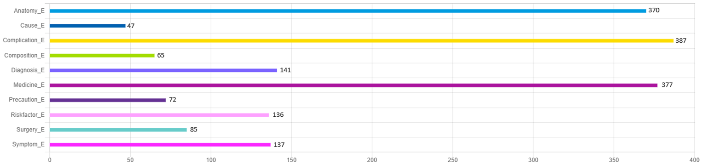
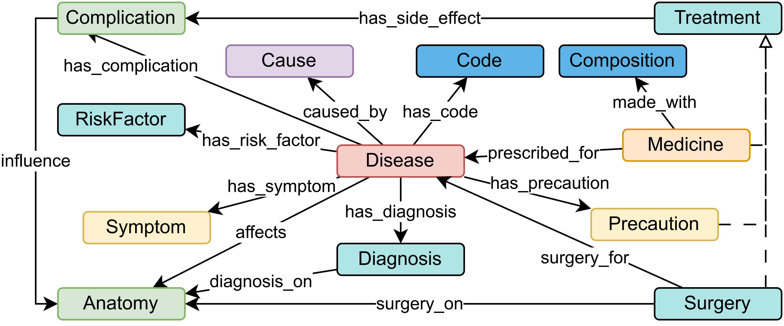

# Disease A-Z Datasets

## Evaluation Data

To address data sparsity via enrichment during data integration, our intrinsic evaluation accounts for a wide variety of entity types and a complex schema (Fig. Schema). For our comparative evaluation, we utilize the **TEST** portion of our annotated text dataset (refer to Table: Annotated Text Dataset Statistics). The task-specific fine-tuning employs the **structured data** for **LM-SD**, and the same data is used to build patterns for the **Baseline** and to fine-tune the embedding vector in our approach, **THOR**. The **LM-Human** is fine-tuned with a contextualized **training** set from the annotated text. For both language models, the **validation** data is used to learn optimal hyperparameters.

The text dataset is split based on the **Diseases** files, aiming to distribute the total number of entities into approximately 70% for training, 20% for validation, and 10% for testing. There are some deviations in the entity counts due to the difficulty in splitting them exactly into 70/20/10 percentages.

#### Annotated Text Dataset (Disease A-Z) Statistics

| \#          | Training | Validation | Test | Total  |
|-------------|----------|------------|------|--------|
| Disease     | 240      | 61         | 13   | 314    |
| Documents   | 1438     | 366        | 90   | 1894   |
| Entities    | 18539    | 3989       | 2222 | 24750  |
| Relations   | 10269    | 2145       | 867  | 13281  |
| Tokens      | 168816   | 38722      | 19237| 226775 |

The following is the individual class-wise statistics of our **TEST** data:

   
  *Figure: Individual Class-wise Statistics of Annotated Test Data.*

#### Statistics of Structured Data

| Sources | Concepts | Subject Instances | Instances |
|---------|----------|-------------------|-----------|
| 10      | 11       | 284               | 4,706     |

---

## Disease A-Z Dataset Description

We consider a health-related data scenario containing **Disease A-Z** information with **Conditions**. The following sections describe the data sources and schema used.

### Structured Data Sources and Integrated Schema

Our structured data sources contain disease and condition information in tabular format (CSVs), following the integrated schema (Fig. Schema). Each structured data source contains two columns relating concepts such as **Disease** and **Anatomy** or **Surgery** and **Anatomy**. We have 10 structured sources containing instances of 11 concepts.

   
  *Figure: The Integrated Schema for our Use Case Datasets.*

---

### Text Data Sources

We annotated a text dataset with concepts and relations shown in our schema (Fig. Schema). The dataset aggregates **Disease/Conditions A-Z** information from major health portals like WHO, NHS, and CDC. We manually collected texts about 1100+ diseases, out of which 314 diseases were annotated. Each disease information is organized into up to eight different text documents indicating major aspects (conditions) of those diseases such as - Overview, Causes, Symptoms, Complications, Diagnosis, Treatment, Prevention, and Risk-factors. Each text file has been named according to the corresponding ICD-11 disease code and name, adhering to the latest 11th edition of International Classification of Diseases (ICD), which can be found at [ICD-11](https://icd.who.int/ct11/icd11_mms/en/release). This gives a 360º view of the diseases, making it a good candidate for Information Extraction and NLP related tasks. A sample disease data source from one of the portal looks like this: [NHS](https://www.nhs.uk/conditions/acne/).

#### <ins>Text Data Annotation Guidelines</ins>:

The following guidelines pertain specifically to the Text Data Annotation portion of our dataset. To facilitate Named Entity Recognition and Relation Extraction, we have compiled a comprehensive health dataset encompassing detailed information on individual diseases. From an initial collection of 1100+ diseases, a total of 314 diseases have been meticulously annotated. Our annotation efforts have been focused on ensuring the highest quality of data. The guidelines adhered to in the annotation process are as follows:

- Development of a specialized schema tailored for the annotation task, serving as a structured guideline.
- Adhering to the Entity labels and Relation labels defined in the schema for the manual annotation process.
- Incorporating several pre-processing such as punctuation corrections, adding abbreviations, processing of bullet points, and integration of disease codes.
- Marking the span of words followed by the selection of appropriate labels from the predefined set of entities, ensuring correct entity annotation.
- Identification and establishment of dependencies between entities, followed by connecting these into corresponding relations, chosen from a list of available relation labels.
- Introduction of global entity type corresponding to the name of the disease to mark implicit relations in text.
- Rigorous validation of chosen entity and relations against the schema to ensuring consistency and accuracy.

By strictly following these guidelines, we aim to create a dataset that is not only precise but also aligns with the intended use-case scenarios.

#### <ins>Annotation Tool and Sample</ins>:

We utilized the open-source tool [doccano](https://doccano.github.io/doccano/) to annotate our dataset. The annotation process involves identifying and labeling entities such as diseases, symptoms, and anatomy, as well as the relations between them, such as causality and symptoms association.

The following image represents a snippet of our annotated text, showcasing how entities and relations are structured within the dataset:

   
  *Figure: A snippet of the annotated text showing entities and relations for Tuberculosis.*

Entities are denoted with suffix `_E` and relations with `_R`, allowing for a clear and concise representation of complex medical information. This structured annotation facilitates the training of models for Named Entity Recognition and Relation Extraction tasks.

#### <ins>Manual Annotation Process</ins> (Labeling):

The annotation process requires meticulous attention to two types of labeling: Entity Labeling and Relation Labeling (Entity Linking).

- **Entity Labeling**: Entities within the text are labeled by selecting one or multiple contiguous words that represent a coherent concept or category.
  
  1. Begin annotating the text data by selecting the appropriate label for each entity from the list provided in Doccano's interface.
  2. Highlight and label the relevant text segments. This process is repeated for each document within the dataset.
  3. Conduct periodic reviews of the annotated data to identify and rectify any errors or inconsistencies.
  4. Utilize Doccano's functionality to modify or delete incorrect annotations, ensuring the high quality and precision of the dataset.
  5. Recognize that annotation is an iterative process; repeat the review and correction steps as necessary to refine the annotations.

- **Relationship Labeling**: Relationships are established by linking two appropriately labeled entities and specifying the nature of their relationship.
  
  1. Upon completion of entity annotation, examine the text to determine if there are any logical relationships between the entities.
  2. Select the first entity and then the second, noting that the order of selection implies the directionality of the relation.
  3. After both entities are selected, choose the appropriate relation label that accurately describes their interaction.
  4. Review the relationships to ensure they are consistent with the predefined schema and accurately reflect the text's content.

#### <ins>Annotation Agreement and Efforts</ins>

Three annotators, each with specialized knowledge, annotated the dataset individually. In cases of disagreement, a separate expert with linguistic expertise ensured the accuracy of the annotations (please check the [Annotation_Agreement.xlsx](https://github.com/dtim-upc/THOR/blob/main/Dataset/Annotation_Agreement.xlsx) file). Thus we ensured 100% Annotation Agreement. Each annotator dedicated between 3 to 6 hours per day to this task, spanning over a period of more than 3 months. Another 1 month is spend for the Agreement and Validation process. Collecting and pre-processing the texts from the sources took about 2 months. Thus the whole process took over 6 months. The table below shows the minimum and maximum time taken for annotating an instances of disease, document, and tokens. It also indicates the approximate total duration of hours it took to annotate the entire dataset by a single annotator.

**Annotation Efforts In Terms of Minimum and Maximum Time**
| Single Disease (min-max) | Single Document (min-max) | Single Token (min-max) | Total Duration (Hours) |
|--------------------------|---------------------------|------------------------|------------------------|
| 80m – 150m               | 7m – 25m                  | 8s – 13s               | 600+                   |
