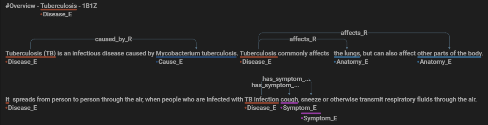

# Dataset: Disease/Conditions A-Z

## Evaluation Datasets and Metrics

For our comparative evaluation, we utilize the **test** portion of our annotated text dataset (refer to Table: Annotated Text Dataset Statistics). The task-specific fine-tuning employs the **structured data** for **LM-SD**, and the same data is used to build patterns for the **Baseline** and to fine-tune the embedding vector in our approach, **THOR**. The **LM-Human** is fine-tuned with a contextualized **training** set from the annotated text. For both language models, the **validation** data is used to learn optimal hyperparameters.

The text dataset is split based on the **Diseases** files, aiming to distribute the total number of entities into approximately 70% for training, 20% for validation, and 10% for testing. There are some deviations in the entity counts due to the difficulty in splitting them exactly into 70/20/10 percentages.

### Annotated Text Dataset (Disease A-Z) Statistics

| \#          | Training | Validation | Test | Total  |
|-------------|----------|------------|------|--------|
| Disease     | 240      | 61         | 13   | 314    |
| Documents   | 1438     | 366        | 90   | 1894   |
| Entities    | 18539    | 3989       | 2222 | 24750  |
| Relations   | 10269    | 2145       | 867  | 13281  |
| Tokens      | 168816   | 38722      | 19237| 226775 |

### Statistics of Structured Data

| Sources | Concepts | Instances | Tokens |
|---------|----------|-----------|--------|
| 10      | 11       | 4706      | 14010  |

## Use Case Datasets

We consider a health-related data scenario containing **Disease A-Z** information with **Conditions**. The following sections describe the data sources and schema used.

### Text Data Sources

To address data sparsity via enrichment during data integration, our intrinsic evaluation accounts for a wide variety of entity types and a complex schema. We annotated a text dataset with concepts and relations shown in our schema (Fig. Schema). The dataset aggregates **Disease/Conditions A-Z** information from major health portals like WHO, NHS, and CDC. We manually collected texts about 314 diseases, organized into up to eight different text documents per condition.

### Structured Data Sources and Integrated Schema

Our structured data sources contain disease and condition information in tabular format (CSVs), following the integrated schema (Fig. Schema). Each structured data source contains two columns relating concepts such as **Disease** and **Anatomy** or **Surgery** and **Anatomy**. We have 10 structured sources containing instances of 11 concepts.

## Annotation Interface and Process

We utilized the open-source tool [doccano](https://doccano.github.io/doccano/) to annotate our dataset. The annotation process involves identifying and labeling entities such as diseases, symptoms, and anatomy, as well as the relations between them, such as causality and symptoms association.

The following image represents a snippet of our annotated text, showcasing how entities and relations are structured within the dataset:

*Figure: A snippet of the annotated text showing entities and relations for Tuberculosis.*

Entities are denoted with suffix `_E` and relations with `_R`, allowing for a clear and concise representation of complex medical information. This structured annotation facilitates the training of models for Named Entity Recognition and Relation Extraction tasks.
