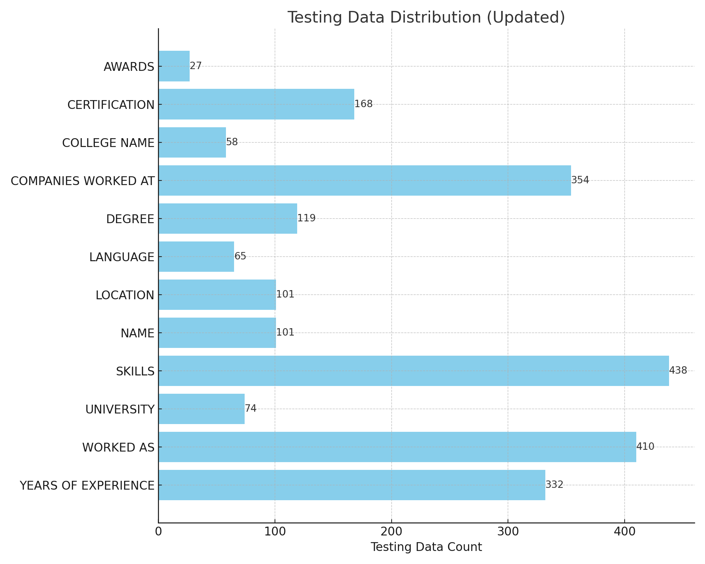

# Résumé Datasets

## Evaluation Data
We used this dataset in order to evaluate the Generalizability of THOR (our approach) against SOTA models. This dataset was generated by collecting information related to Résumé of job-seekers. We randomly selected 270 resume from the original dataset and compiled 54 documents (each containing 5 CVs) from these resumes. The [**original dataset**](https://www.romanshilpakar.com.np/blog/6) is a collection of 1014 annotated resumes. This dataset extended the schema of the following **PAPER** in order to annotate the resumes.

- **Pinzon, J. F., Krainikovsky, S., & Samarev, R. (2020). "Limitations of neural networks-based ner for resume data extraction." Procesamiento del Lenguaje Natural, 65, 53-58.**

#### Annotated Text Dataset (Disease A-Z) Statistics

| \#          | Training | Validation | Test | Total  |
|-------------|----------|------------|------|--------|
| Resume      | 100      | 70         | 100  | 270    |
| Documents   | 20       | 14         | 20   | 54     |
| Entities    | 1656     | 1463       | 2140 | 5259   |
| Tokens      | 41675    | 25389      | 38459| 105523 |

The following is the individual class-wise statistics of our **TEST** data:

   
  *Figure: Individual Class-wise Statistics of Annotated Test Data.*

#### Statistics of Structured Data

We created a total of 12 CSV files (once for each concept in the dataset - see below the description of the dataset) containing only the **Entities** from the **training** and **validation** set of the annotated text. These entities in essence form the instances in our structured data sources whereas the concept name acts as the column name. 

| Sources | Concepts | Subject Instances | Instances |
|---------|----------|-------------------|-----------|
| 12      | 12       | 201               | 3119      |

---

## Résumé Dataset Description

The dataset contains the following 12 concepts where **NAME** is the subject concept:

- **NAME**: The full name of an individual.
- **AWARDS**: Recognitions or honors received by an individual for achievements.
- **CERTIFICATION**: Official documentation proving an individual's qualifications or competencies.
- **COLLEGE NAME**: The name of a post-secondary education institution that an individual attended.
- **COMPANIES WORKED AT**: Names of businesses or organizations where an individual has been employed.
- **DEGREE**: Academic title awarded by a college or university to an individual upon completion of a course of study.
- **LANGUAGE**: Languages known or spoken by an individual.
- **LOCATION**: Geographical areas or places associated with an individual or an event.
- **SKILLS**: Specific abilities, proficiencies, or expertise possessed by an individual.
- **UNIVERSITY**: The name of a higher education and research institution that an individual attended.
- **WORKED AS**: Job titles or roles held by an individual in their professional career.
- **YEARS OF EXPERIENCE**: The total duration of an individual's professional work experience.

---

